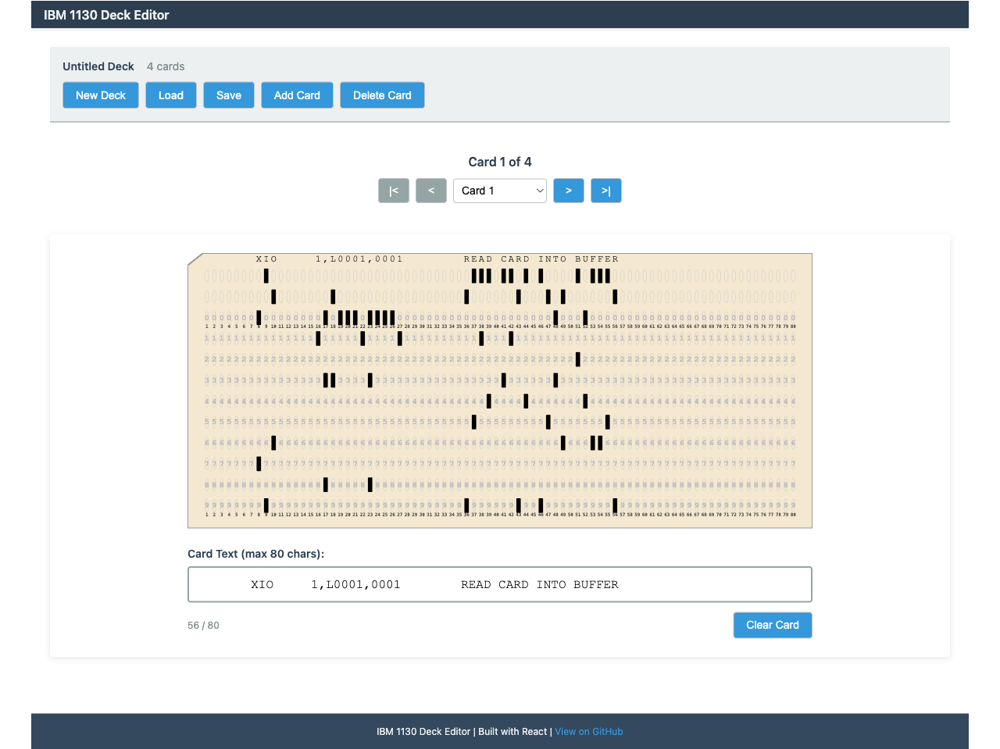

# IBM 1130 Deck Editor

A browser-based single-page application for creating, editing, and managing IBM 1130 punch card decks. Built with React, HTML5, CSS3, and vanilla JavaScript following Test-Driven Development (TDD) principles.


**[Try the Live Demo →](https://wrightmikea.github.io/deck-editor/)**



---

## Overview

The Deck Editor extends the concept of the [single-card punch-card editor](https://github.com/wrightmikea/punch-card) to support multi-card decks with features including:

- Create and edit IBM 1130 punch card decks
- Load decks from binary files (108 bytes per card)
- Save decks to IBM 1130 format
- Authentic SVG punch card visualization
- Real-time card punching with text input
- Navigate between cards in a deck
- Test-Driven Development with 90%+ coverage goal
- E2E testing with Playwright via MCP

---

## Features

### Current Status: MVP Complete

**MVP Features (Completed)**:
- [x] Comprehensive documentation
- [x] Deck management (new, load, save, add/delete cards)
- [x] Card viewing with SVG rendering (Hollerith punch patterns)
- [x] Card editing with text input (max 80 characters)
- [x] File I/O (IBM 1130 108-byte format)
- [x] Card navigation (next, previous, jump to card N)
- [x] Real-time visual feedback

**Future Features (Phase 2)**:
- [ ] REST API integration for cloud storage
- [ ] Advanced editing (binary mode, column-by-column)
- [ ] Deck operations (merge, split, sort)
- [ ] Card templates and examples
- [ ] Export/import (text, JSON, CSV)

---

## Technology Stack

### Core Technologies
- **React 18+** - UI framework
- **JavaScript ES6+** - No TypeScript
- **HTML5** - Semantic markup, File API
- **CSS3** - Modern styling (flexbox/grid)

### Development Tools
- **Webpack/Vite** - Build tool
- **Babel** - JSX transpilation
- **Jest** - Unit testing
- **React Testing Library** - Component testing
- **Playwright (MCP)** - E2E testing

### Methodology
- **Test-Driven Development (TDD)** - Red/Green/Refactor cycle
- **Red Phase**: Write failing test
- **Green Phase**: Make test pass
- **Refactor Phase**: Improve code quality

---

## IBM 1130 Punch Card Format

### Card Structure
- **80 columns** - Standard IBM punch card width
- **12 rows** - Row 12, 11, 0-9 (Hollerith encoding)
- **Columns 1-72** - Data area (stored in binary format)
- **Columns 73-80** - Sequence numbers (not stored)

### File Format
- **Binary Format**: 108 bytes per card
- **Calculation**: 72 columns x 12 rows = 864 bits = 108 bytes
- **Deck File**: Concatenated 108-byte card records

```
Card 1: [108 bytes]
Card 2: [108 bytes]
Card 3: [108 bytes]
...
```

---

## Project Structure

```
deck-editor/
|-- docs/                       # Documentation
|   |-- architecture.md         # System architecture
|   |-- prd.md                  # Product requirements
|   |-- design.md               # UI/UX design
|   |-- plan.md                 # Implementation plan
|   |-- process.md              # TDD process guide
|   +-- status.md               # Current status
|-- public/                     # Static assets
|   +-- index.html              # HTML entry point
|-- src/                        # Source code
|   |-- components/             # React components
|   |   |-- App.js              # Root component
|   |   |-- Header.js           # App header
|   |   |-- DeckManager.js      # Deck operations
|   |   |-- CardNavigator.js    # Card navigation
|   |   |-- CardDisplay.js      # Card view/edit container
|   |   |-- CardViewer.js       # SVG card rendering
|   |   |-- CardEditor.js       # Text input editor
|   |   +-- Footer.js           # App footer
|   |-- contexts/               # React contexts
|   |   |-- DeckContext.js      # Deck state management
|   |   +-- SettingsContext.js  # App settings
|   |-- utils/                  # Business logic
|   |   |-- HollerithCode.js    # Hollerith encoding
|   |   |-- Column.js           # Card column model
|   |   |-- PunchCard.js        # Punch card model
|   |   |-- Deck.js             # Deck operations
|   |   +-- FileIO.js           # File load/save
|   |-- tests/                  # Test files
|   |   |-- HollerithCode.test.js
|   |   |-- Column.test.js
|   |   |-- PunchCard.test.js
|   |   |-- Deck.test.js
|   |   +-- ...
|   +-- index.js                # App entry point
|-- package.json                # Dependencies
|-- webpack.config.js           # Webpack config (or vite.config.js)
|-- babel.config.js             # Babel config
|-- jest.config.js              # Jest config
|-- .eslintrc.js                # ESLint config
+-- README.md                   # This file
```

---

## Getting Started

### Prerequisites
- Node.js 16+ and npm

### Installation

**Note**: Project is in planning phase. Implementation not started.

Once implemented, installation will be:

```bash
# Clone the repository
git clone https://github.com/wrightmikea/deck-editor.git
cd deck-editor

# Install dependencies
npm install

# Start development server
npm start

# Open browser to http://localhost:8080
```

---

## Usage

### Creating a New Deck

1. Click "New Deck" button
2. Start with one blank card
3. Type text (up to 80 characters) to punch the card
4. Click "Add Card" to add more cards
5. Navigate between cards using Previous/Next buttons

### Loading a Deck

1. Click "Load" button
2. Select a `.deck` file (IBM 1130 108-byte format)
3. Deck loads and displays first card
4. Navigate through cards to view/edit

### Editing Cards

1. Select a card using navigation controls
2. Type in the text input field (max 80 characters)
3. Text is automatically converted to uppercase
4. See Hollerith punch patterns update in real-time
5. Click "Clear Card" to reset current card

### Keyboard Shortcuts

The deck editor supports keyboard shortcuts for efficient card navigation, similar to an authentic keypunch machine:

- **Enter** - Advance to next card (or add new card if at end of deck)
- **Tab** - Advance to next card (or add new card if at end of deck)
- **Shift+Tab** - Navigate to previous card

These shortcuts work when the text input field is focused, enabling rapid card entry without reaching for the mouse.

### Saving a Deck

1. Click "Save" button
2. Browser downloads file: `deck-YYYYMMDD-HHMMSS.deck`
3. File is in IBM 1130 108-byte format
4. Can be loaded back into deck editor or used with IBM 1130 simulator

---

## Development

### Running Tests

```bash
# Run all tests
npm test

# Run tests in watch mode
npm run test:watch

# Generate coverage report
npm run test:coverage
```

### TDD Workflow

**Red Phase**:
```javascript
// Write failing test
test('should convert character A to Hollerith code', () => {
  const code = HollerithCode.fromChar('A');
  expect(code.asArray()[12]).toBe(true); // Row 12
  expect(code.asArray()[1]).toBe(true);  // Row 1
});
```

**Green Phase**:
```javascript
// Implement minimal code to pass
static fromChar(char) {
  const rows = new Array(12).fill(false);
  if (char === 'A') {
    rows[12] = true;
    rows[1] = true;
  }
  return new HollerithCode(rows);
}
```

**Refactor Phase**:
```javascript
// Improve implementation
static fromChar(char) {
  const encoding = HOLLERITH_TABLE[char.toUpperCase()];
  return this.createFromEncoding(encoding);
}
```

See [docs/process.md](./docs/process.md) for complete TDD guide.

---

## Testing

### Test Coverage Goals

| Component | Target Coverage |
|-----------|----------------|
| HollerithCode | 100% |
| Column | 95% |
| PunchCard | 90% |
| Deck | 90% |
| FileIO | 90% |
| React Components | 80% |
| **Overall** | **90%+** |

### Test Types

**Unit Tests** (Jest):
- Pure functions
- Class methods
- Data transformations
- Encoding/decoding logic

**Integration Tests** (React Testing Library):
- Component interactions
- Context state management
- Form handling

**E2E Tests** (Playwright via MCP):
- Complete user workflows
- File upload/download
- Card navigation
- Error scenarios

---

## Documentation

### Available Docs

- **[architecture.md](./docs/architecture.md)** - System architecture and component design
- **[prd.md](./docs/prd.md)** - Product requirements and feature specifications
- **[design.md](./docs/design.md)** - UI/UX design and component specs
- **[plan.md](./docs/plan.md)** - Implementation plan and timeline
- **[process.md](./docs/process.md)** - TDD process and workflow
- **[status.md](./docs/status.md)** - Current implementation status

---

## Roadmap

### Phase 0: Project Setup (Week 1, Days 1-2)
- [x] Documentation complete
- [x] Initialize npm project
- [x] Configure build tools (Webpack)
- [x] Setup testing infrastructure (Jest + Playwright)

### Phase 1: Core Data Models (Week 1, Days 3-5)
- [x] HollerithCode class (TDD)
- [x] Column class (TDD)
- [x] PunchCard class (TDD)
- [x] Deck class (TDD)
- [x] Binary I/O implementation

### Phase 2: React Components (Week 2)
- [x] App state management (React hooks)
- [x] CardViewer component (SVG rendering)
- [x] CardEditor component (text input)
- [x] CardNavigator component
- [x] DeckManager component

### Phase 3: File I/O (Week 3)
- [x] File loading implementation
- [x] File saving implementation
- [x] Validation and error handling

### Phase 4: Integration & E2E Testing (Week 3-4)
- [x] E2E test: Create new deck
- [x] E2E test: Load and edit deck
- [x] E2E test: Save deck
- [x] E2E test: Card navigation

### Phase 5: Polish & Deploy (Week 4)
- [x] Screenshot capture with Playwright
- [x] GitHub Actions workflow for deployment
- [ ] Performance optimization (future)
- [ ] Accessibility audit (WCAG 2.1 Level AA) (future)
- [ ] User documentation (future)
- [ ] Deploy to GitHub Pages (pending)

---

## Contributing

This is an educational project focused on preserving computing history and demonstrating TDD best practices.

**Development Process**:
1. All code follows TDD approach (Red -> Green -> Refactor)
2. Write tests first, then implementation
3. Maintain 90%+ test coverage
4. Use ESLint for code style
5. Document all public APIs

---

## Browser Compatibility

### Minimum Requirements
- Chrome/Edge 88+
- Firefox 89+
- Safari 15+

### Required Features
- ES6+ JavaScript support
- File API (for file upload/download)
- Blob support
- SVG rendering

---

## Performance Benchmarks

### Target Performance

| Metric | Target |
|--------|--------|
| Page load time | < 2 seconds |
| Deck load (100 cards) | < 2 seconds |
| Deck load (1000 cards) | < 5 seconds |
| Card navigation | < 100ms response |
| Text input latency | < 50ms |
| File save (100 cards) | < 3 seconds |

---

## Related Projects

- **[wrightmikea/punch-card](https://github.com/wrightmikea/punch-card)** - Single card editor (Yew/Rust/WASM)
- **[wrightmikea/S1130-rs](https://github.com/wrightmikea/S1130-rs)** - IBM 1130 simulator (Rust)

---

## Resources

### IBM 1130 & Punch Cards
- [IBM 1130 Wikipedia](https://en.wikipedia.org/wiki/IBM_1130)
- [IBM 029 Card Punch History](https://twobithistory.org/2018/06/23/ibm-029-card-punch.html)
- [Hollerith Encoding Reference](https://homepage.divms.uiowa.edu/~jones/cards/codes.html)
- [IBM 1130 Binary Format](https://dialectrix.com/G4G/ZebraStripeCard.html)

### Technical References
- [React Documentation](https://react.dev/)
- [Jest Documentation](https://jestjs.io/)
- [Playwright Documentation](https://playwright.dev/)
- [File API Specification](https://w3c.github.io/FileAPI/)
- [WCAG 2.1 Guidelines](https://www.w3.org/WAI/WCAG21/quickref/)

---

## License

MIT License

Copyright (c) 2025 Michael A. Wright

See [LICENSE](LICENSE) file for full license text.

---

## Author

**Michael A Wright**

Copyright (c) 2025 Michael A. Wright. All rights reserved.

Inspired by the IBM 029 keypunch machines from the 1960s-70s and built to preserve and teach computer history.

---

## Acknowledgments

- IBM 029 keypunch machine design
- Authentic Hollerith punch card encoding
- Historical IBM 1130 computing system
- Open source community

---

## Status

**Current Phase**: MVP Complete - Ready for Acceptance Testing

**Completed Work**:
1. Full TDD implementation (65 passing tests)
2. Core data models (HollerithCode, Column, PunchCard, Deck)
3. Complete React UI with all features
4. Binary I/O (IBM 1130 108-byte format)
5. GitHub Actions workflow for deployment

**Next Steps**:
1. User acceptance testing
2. Deploy to GitHub Pages
3. Bug fixes and enhancements based on feedback

See [docs/status.md](./docs/status.md) for detailed progress tracking.

---

**Built with React, following Test-Driven Development, preserving computing history**
